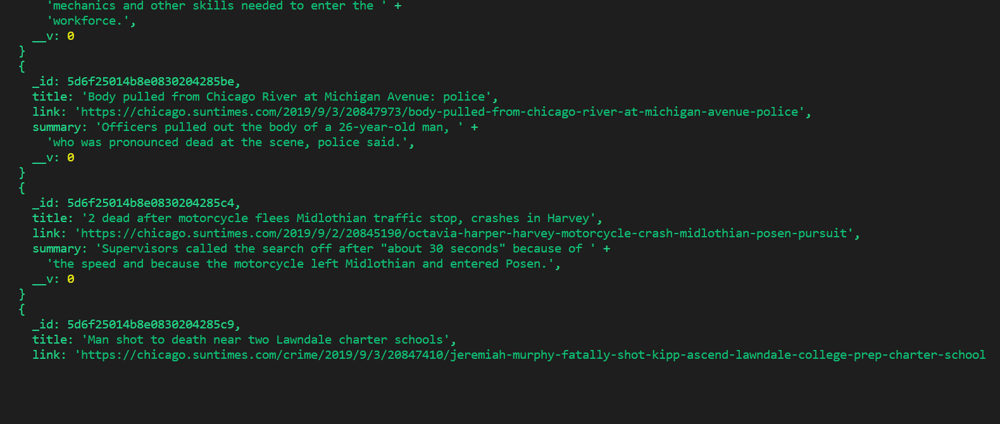

# life_fashion
Welcome to my Life_fashion Application if you like it please check out my Github Profile to see my repositories.

Life_fashion is a scraping app. where you can add comment and delete them 

the Life_fashion application utilizes and requires these npm packages:

axios

cheerio

express

mongoose

morgan

other technology used:

 html css and javascript and npm packages.

how to install it?

npm install express, mongoose, morgan  and npm i to have all the packages.

to create a node module:

npm init -y

#Getting Started with the life_fashion node command line application
WARNING: If you are not familiar with the bash/terminal this app may not be suitible for you but feel free to try anyways.

Welcome user! So you want to use my command line node app? Okay! lets get started.

You are going to need to have Node.js Installed in order to run this javascript file in the terminal or command line.

Assuming you are familiar with node as well as the terminal/cli and are ready to move on continue to the next steps

STEP ONE:

You will need to go to my Github repository, you can then either fork the repository and copy the Clone with HTTPS link then run the following command with the link copied from your forked version of the repo to replace what comes after "git clone" from your terminal or bash window or clone my repository the same way using the link on my Github repo the command will look like this in the terminal/CLI:
Command:

git clone https://github.com/idiatou69/life_fashion

how it works:

after installing all your packages that I have mentioned earlier then you open your command line to run the server.js

you do npm start then you open the localhost 3000, then you can start scrapping . and save notes on it then it will return on your terminal like this

